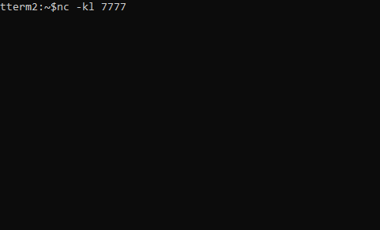

## _Term2_

Small utility to split output in new terminal via tcp/udp, like **nc** in Linux or **ncat** for windows. Useful for debug goroutine.
How to use:
 - for Linux: open new terminal, ex: run `nc -k -l 7777` 
 - for Windows: open new terminal, ex: run `ncat -k -l 7777`

Check nc/ncat for download here [nmap.org](https://nmap.org/download.html)

Usage:
```
package main

import (
	"bufio"
	"github.com/flyerge/term2"
	"fmt"
	"os"
	"time"
)

func main() {
	t2 := term2.New("7777")
	go goroutine("Waiting for data ", *t2)
	fmt.Println("Press Enter to exit")
	bufio.NewReader(os.Stdin).ReadBytes('\n')

}

func goroutine(msg string, t2 term2.Term2) {
	rot := "/-\\|"
	t2.Prnl(msg)
	time.Sleep(3 * time.Second)
	for {
		func() {
			for _, c := range rot {
				t2.Cls().Prn(string(c))
				time.Sleep(300 * time.Millisecond)
			}
		}()
	}
}
```



> https://en.wikipedia.org/wiki/ANSI_escape_code
